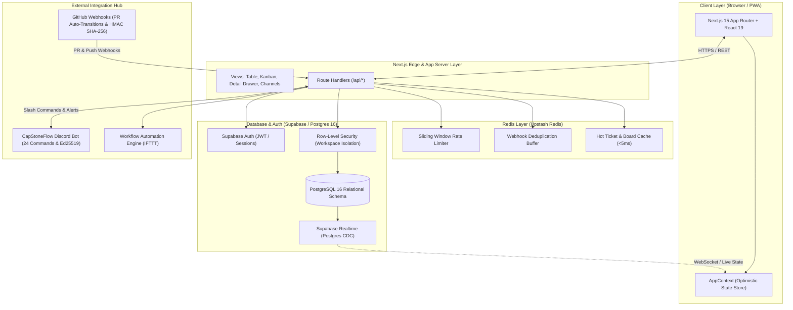

# HappyTF — System Architecture Document

## 1. Executive Summary

**HappyTF** is a high-performance, collaborative team workspace, task workflow, and ticketing platform. Inspired by the speed and craftsmanship of Linear, the versatility of Monday.com, and the clean developer-first aesthetic of Supabase, HappyTF provides:

- **Ultra-fast task & ticket workflows**: Table and Kanban board views with real-time multi-tenant updates.
- **Optimistic Concurrency Control (OCC v2)**: Instant client-side state manipulation with collision safety.
- **Team Communications**: Workspace-scoped team channels, threaded discussion, and live emoji reactions.
- **Developer Tool Integrations**: Inbound GitHub commit webhook sync (`#TK-xxxx`), Slack alerts, and external platform bridges.
- **Performance & Security**: Redis-backed caching and rate-limiting paired with strict PostgreSQL Row-Level Security (RLS).

---

## 2. Architecture Diagram

---

## 3. Layer Specifications

### 3.1 Frontend & Client Engine
- **Framework**: Next.js 15 (App Router) with React 19.
- **Styling Architecture**: Vanilla CSS design tokens (`src/styles/`), dark/light canvas mode, custom HSL palette, and glassmorphic micro-interactions defined in `DESIGN.md`.
- **Keyboard-First Navigation**:
  - `Cmd+K` / `Ctrl+K`: Global command palette.
  - `J` / `K`: Keyboard row navigation across task lists.
  - Quick modals for task creation, workspace management, and collaborator invites.
- **Optimistic Concurrency Control (OCC v2)**:
  - Updates apply instantly to local client state.
  - Sent to server with an `X-Ticket-Version` header matching the row's `version` integer.
  - If a collision occurs (status code `409 Conflict`), the UI gracefully reconciles or prompts the user.
- **Realtime State Synchronization**:
  - `useRealtimeTickets` hooks directly into Supabase Realtime (PostgreSQL Change Data Capture).
  - Pushes live inserts, updates, and deletes to all active workspace members without full refetches.

---

### 3.2 Backend & API Route Handlers (`src/app/api/`)

| Endpoint | Method(s) | Description |
|---|---|---|
| `/api/tickets` | `GET`, `POST` | Ticket CRUD, SLA target calculation, priority & severity tagging. |
| `/api/tickets/[id]` | `PATCH`, `DELETE` | Versioned task updates with OCC enforcement. |
| `/api/tickets/[id]/claim` | `POST` | Atomic task claiming with race-condition mitigation. |
| `/api/tickets/comments` | `GET`, `POST` | Threaded discussion comments per ticket. |
| `/api/channels` | `GET`, `POST` | Team communication channels within a workspace. |
| `/api/channels/[id]/messages` | `GET`, `POST` | Channel messages with rich content and emoji reactions. |
| `/api/webhooks/github` | `POST`, `GET` | Inbound GitHub push and PR webhook handler with HMAC SHA-256 verification and automatic `#TK-xxxx` transitions (`In Review`, `Done`). |
| `/api/integrations/discord/*` | `POST`, `GET` | CapStoneFlow Discord Bot interaction gateway (Ed25519 verified), slash command dispatch, and thread synchronizer. |

---

### 3.3 Caching, Rate-Limiting & Idempotency (`src/lib/redis.ts`)
- **Rate Limiting**: Sliding-window rate limiting on sensitive API endpoints to protect against bursts and abuse.
- **Webhook Deduplication**: Ingest buffer and idempotency checks (`idempotency:[event_id]`) to prevent duplicate webhook delivery from GitHub or Discord.
- **Session & Board Cache**: In-memory caching for workspace metadata and active board summaries for sub-5ms response times.

---

### 3.4 Database & Security Architecture (`supabase/migrations/`)

#### Relational Entities:
1. **`workspaces` & `workspace_members`**: Multi-tenant isolation hierarchy with `owner`, `admin`, and `member` roles.
2. **`boards` & `groups`**: Customizable workflow groupings and columns.
3. **`tickets`**: Core task records with monotonic `version` counter, SLA due dates, priority, severity, and status (`triage`, `backlog`, `in_progress`, `review`, `stuck`, `done`, `archived`).
4. **`ticket_comments` & `ticket_activities`**: Immutable activity audit trails and conversation history.
5. **`team_channels` & `channel_messages`**: Integrated team chat infrastructure.
6. **`integrations`**: Secure storage for external webhook endpoints and credentials.

#### Security & Tenant Isolation:
- **Row-Level Security (RLS)**: Enforced across all tables.
- **Non-Recursive Membership Helpers**: Helper functions `is_workspace_member(workspace_id, user_id)` and `is_workspace_admin_or_owner(workspace_id, user_id)` defined with `SECURITY DEFINER` and optimized subqueries to prevent infinite RLS recursion.
