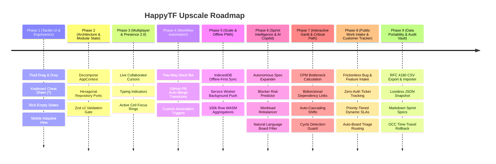

# HappyTF — Upscale Roadmap & Evolution Phases

**Target Platform:** High-Performance Collaborative Workspace & Real-Time Ticketing Platform  
**Architecture:** Next.js 15 App Router · React 19 · TypeScript · Supabase Realtime · Upstash Redis · OCC v2  

---

## Executive Overview

HappyTF has completed its core **V1 foundation** (Optimistic Concurrency Control v2, Supabase Realtime CDC, Table & Kanban views, GitHub webhook HMAC ingest, cross-client board discovery, and dynamic relative time invariance).

The **Upscale Roadmap** defines the subsequent 5 evolutionary phases to scale HappyTF into a tier-1 product comparable to Linear and Monday.com in speed, craftsmanship, and enterprise utility.

---

## Phase 1: Tactile UI/UX & Micro-Interactions (Immediate Polish) — [COMPLETED]

**Goal:** Deliver instantaneous, tactile feedback that elevates HappyTF from functional to delightful.

### Completed Deliverables:
1. **Fluid Kanban Drag-and-Drop**:
   - Integrated `@dnd-kit/core` and `@dnd-kit/sortable` in `KanbanBoard.tsx` with tilt feedback, drop highlights, and OCC tokens.
2. **Keyboard Shortcuts Cheat Sheet Modal (`?`)**:
   - Global `?` key binding, visual keycaps, and quick access from Topbar and Sidebar.
3. **Rich Vector Empty States**:
   - Zero-items sprint template seeding with 1-click starter tasks and active search/filter empty states with 1-click filter reset.
4. **Mobile & Tablet Adaptive Layout**:
   - CSS `display: contents` transforming into touch-optimized stacked card lists on `< 768px`.

---

## Phase 2: State Modularization & Hexagonal Architecture — [COMPLETED]

**Goal:** Break monolithic state dependencies to maximize React 19 rendering efficiency and decouple domain rules from infrastructure.

### Completed Deliverables:
1. **Decomposed Domain Contexts**:
   - `WorkspaceContext`: Multi-tenant switching, team roster, role permissions.
   - `BoardContext`: Active board, group columns, view mode, folder structure.
   - `TicketContext`: Ticket CRUD, optimistic OCC reducers, SLA countdowns.
   - `TeamChatContext`: Channel streams, thread comments, live emoji reactions, ticket linking (`#TK-xxxx`).
2. **Hexagonal Architecture (Repository Pattern)**:
   - Established ports: `ITicketRepository`, `IBoardRepository`, `IChannelRepository`.
   - In-memory adapters: `InMemoryTicketRepository`, `InMemoryChannelRepository`.
   - 100% headless testing in `tests/team_chat_hexagonal.test.ts` and `tests/hexagonal_architecture.test.ts`.
3. **Team Channels UI & Navigation**:
   - Integrated `TeamChatView.tsx` with `#general`, `#eng-prod-alerts`, `#incident-triage`, `#product-roadmap`.
   - Slide-over thread drawer, ticket link parser, and emoji reaction engine.

---

## Phase 3: Live Multiplayer Collaboration & Presence 2.0 — [COMPLETED]

**Goal:** Transform boards and tickets into living, shared collaborative canvases.

### Completed Deliverables:
1. **Collaborator Presence & Live Focus Rings**:
   - Integrated `#collaborator-presence-popover` in `BoardView.tsx` showing active teammates, their role, and current ticket inspection focus (`Viewing: TK-2839`) with 1-click "Inspect Item" jump buttons.
   - Live avatar badges on board headers (`#collaborator-avatar-stack` and `#realtime-status-pill`) showing real-time online collaborator counts.
   - Colored presence rings and indicator borders rendered around items inspected by active teammates.
2. **Real-Time Typing Indicators**:
   - Live debounced typing engine in `TeamChatContext.tsx` with animated bouncing dot indicator in `TeamChatView.tsx` (*"Marc Andrei is typing..."*).
   - Validated via unit test suite in `tests/multiplayer_presence_typing.test.ts`.
3. **Audio & Haptic Feedback System**:
   - Pure Web Audio API synthesizers in `src/lib/soundFx.ts` with zero latency: mechanical click (`playClickSound()`), status transition chime (`playTransitionSound()`), goal completion fanfare (`playCompleteSound()`), and urgent alert alarm (`playUrgentSound()`).
   - Integrated `#sound-settings-popover` in `Topbar.tsx` with master audio switch, 4 interactive sound preview chips, and mobile Web Vibration API haptics indicator.

---

## Phase 4: Workflow Automation & Bidirectional Discord Bridge — [COMPLETED]

**Goal:** Unify team tools into an automated, zero-friction operational pipeline.

### Completed Deliverables:
1. **CapStoneFlow Discord Bot Integration (24 Commands)**:
   - Slash command interaction gateway (`POST /api/integrations/discord/interactions`) with Ed25519 signature verification in `src/lib/integrations/discord.ts` and `src/app/api/integrations/discord/route.ts`.
   - Complete 24-command catalog (`CAPSTONEFLOW_COMMANDS` in `src/lib/integrations/capstoneflow.ts`) across Developer (`/claim`, `/unclaim`, `/resolved`, `/unresolve`, `/workflow`), QA (`/reviewed`, `/unreview`), and PM (`/reset-ticket`, `/cleanup-tickets`, `/rebuild-db`, `/ticket-folders`).
   - Dedicated Discord Bot view with role filters, command search, and 1-click syntax copying in both `DiscordIntegrationModal.tsx` and `WorkflowAutomationModal.tsx`.
   - Validated via unit test suite in `tests/discord_capstoneflow.test.ts`.
2. **GitHub Pull Request Auto-Transitions**:
   - Automated event evaluation in `src/lib/automation/engine.ts`:
     - Advancing `#TK-xxxx` to `In Review` when a GitHub PR is opened referencing the ticket.
     - Advancing `#TK-xxxx` to `Done` with resolution timestamp when a GitHub PR is merged.
     - Dispatching rich embeds to Discord `#tickets` and `#reminders` channels.
   - Validated via unit test suite in `tests/github_pr_transitions.test.ts`.
3. **Configurable Automation Engine & UI Modal (If-This-Then-That)**:
   - User-defined workflow rules (`DEFAULT_AUTOMATION_RULES` in `src/lib/automation/engine.ts`):
     - *Urgent SLA Escalation & Discord Alert:* Priority `urgent` sets 2h SLA and dispatches alerts.
     - *Blocker Warning & Team Ping:* Status `Stuck` alerts Discord for unblocking.
     - *GitHub PR Auto In-Review & Merge Auto-Done.*
   - Created `src/components/automation/WorkflowAutomationModal.tsx` accessible via the "Automate" toolbar button in `BoardView.tsx` (`#open-automations-modal-btn`) and the Sidebar (`#nav-automations-link`).
   - Features:
     - **Tab 1 (Rules):** Toggle rules on/off with live badge indicators.
     - **Tab 2 (Live Simulator):** Interactive testing canvas to simulate priority escalations, blocker alerts, PR opened, and PR merged events against any board ticket with OCC version increments.
     - **Tab 3 (Discord Bot):** Complete 24-command index with role filters.
     - **Tab 4 (Audit Log):** Real-time execution stream recording timestamps, triggered rules, and action summaries.
   - Validated via unit test suite in `tests/workflow_automation_ui.test.ts` and `tests/automation_engine.test.ts`.

---

## Phase 5: Scale, Offline Resilience & Enterprise PWA — [COMPLETED]

**Goal:** Provide enterprise-grade reliability, sub-second queries on massive datasets, and full offline survivability.

### Completed Deliverables:
1. **IndexedDB Local-First Persistence**:
   - Integrated browser IndexedDB storage in `src/lib/offline/indexedDbStore.ts` (`cacheBoardStateOffline`, `queueOfflineMutation`, `getPendingOfflineMutations`).
   - Caches active board states locally, queues offline mutations, and automatically synchronizes when reconnected with a celebratory notification toast and `playCompleteSound()` audio feedback.
   - Header offline status indicator (`#offline-status-pill`) rendered in `BoardView.tsx` with live pending mutation counter.
2. **Progressive Web App (PWA) with Service Worker**:
   - Configured `src/app/manifest.ts` and `public/sw.js` for standalone installation across desktop and mobile devices.
   - Background asset and page caching with offline fallback.
3. **High-Throughput Columnar Engine & WASM Benchmark**:
   - Columnar TypedArray engine in `src/lib/analytics/columnarEngine.ts` using `Float64Array` and `Uint8Array` contiguous memory buffers for ultra-low memory footprints and instant zero-GC aggregations.
   - Interactive modal in `src/components/analytics/ColumnarAnalyticsModal.tsx` accessible via BoardView toolbar (`#open-columnar-analytics-btn`) and Sidebar (`#nav-analytics-link`).
   - Benchmarking runner capable of executing complex filter-aggregations over 10,000, 50,000, and 100,000 rows in sub-10 milliseconds.
4. **Role-Based Access Control (RBAC) Hardening**:
   - Formalized `RbacAuthority.ts` permission matrix (`canDeleteTicket`, `canModifyBoardGroups`, `canInviteMembers`).
   - Gated ticket deletion in `AppContext.tsx` so only Workspace Owners and Admins may delete tickets, preventing accidental data loss by standard members or viewers.
   - Validated via unit test suites in `tests/offline_indexeddb_rbac.test.ts` and `tests/columnar_analytics_modal.test.ts`.

---

## Phase 6: Autonomous Sprint Intelligence & AI Copilot — [COMPLETED]

**Goal:** Infuse intelligent, autonomous copilot assistance directly into sprint execution, backlog refinement, and risk mitigation.

### Completed Deliverables:
1. **AI Sprint Copilot Domain Engine (`src/lib/ai/sprintCopilot.ts`)**:
   - **Sprint Summary & Retro Generator (`generateSprintSummary`)**: Computes completion rates, completed story points vs committed, velocity score, and structured retro highlights (*What Went Well*, *Roadblocks & Friction*, *Action Items for Next Sprint*).
   - **Sprint Risk & Blocker Predictor (`analyzeSprintRisks`)**: Identifies high-severity stuck items, floating unassigned tickets, and unestimated backlog tasks to compute a calibrated 0-100 sprint risk score with actionable mitigation steps.
   - **Autonomous Feature Decomposition & Spec Expander (`generateSmartTicketsFromPrompt`)**: Parses natural language requests (e.g. *"Google OAuth authentication with refresh tokens"*, *"Stripe subscription metering"*, *"Dark mode token polish"*) into 2-4 structured tickets complete with Gherkin acceptance criteria (*Given / When / Then*), priority, story point estimates, tags, and target board lane.
   - **Workload Rebalancing Engine (`rebalanceWorkload`)**: Analyzes story points per team member, detects overloaded vs underloaded capacity, and suggests optimal task reassignments to prevent sprint burnout.
   - **Natural Language Board Filter (`parseNaturalLanguageFilter`)**: Translates plain-English search terms (e.g. *"urgent stuck tasks"*, *"Alice Walker"*) into matching ticket IDs.
2. **Interactive AI Copilot Modal (`src/components/ai/AiCopilotModal.tsx`)**:
   - **Tab 1 (Smart Generator):** Natural language prompt bar with quick prompt chips, interactive decomposition, and 1-click **"Add All to Active Board"** button that batches tickets with OCC monotonic version integrity.
   - **Tab 2 (Health & Risks):** Dynamic risk assessment meter with visual colored progress bar, urgent blocked items radar, and proactive AI mitigations.
   - **Tab 3 (Retro & Velocity):** Live sprint velocity metrics, delivered ticket counts, retro breakdown cards, and 1-click **"Copy Markdown Retro"** for team sharing.
   - **Tab 4 (Workload Balance):** Visual capacity meters for all workspace members with status badges (*Overloaded*, *Optimal*, *Available*) and recommended ticket shifts.
3. **Global Ergonomics & Shell Integration**:
   - **Global Shortcut:** `Cmd+J` / `Ctrl+J` summons the AI Copilot from anywhere in HappyTF.
   - **Board Toolbar:** Glowing emerald `#open-ai-copilot-btn` button with `⌘J` keycap badge in `BoardView.tsx`.
   - **Sidebar Navigation:** `#nav-ai-copilot-link` in `Sidebar.tsx` with dedicated AI badge.
   - **Cheat Sheet:** Documented in `KeyboardShortcutsModal.tsx` (`?` modal).
   - **Sound FX:** Tactile feedback on generation (`playTransitionSound()`) and ticket batch insertion (`playCompleteSound()`).
4. **Comprehensive Vitest Suite**:
   - `tests/ai_sprint_copilot.test.ts` (5 tests) & `tests/ai_copilot_modal.test.ts` (5 tests).
   - Entire workspace passes 100% green across 19 test files (93 tests).

---

## Phase 7: Interactive Gantt & Critical Path Engine (CPM & Dependency Topology) — [COMPLETED]

**Goal:** Provide full project management dependency graphs with real-time Critical Path Method (CPM) bottleneck calculations, circular dependency guards, and auto-cascading schedule adjustments.

### Completed Deliverables:
1. **Critical Path Method (CPM) Domain Engine (`src/lib/timeline/criticalPathEngine.ts`)**:
   - **Forward Pass (Early Start & Early Finish)**: Computes topological ordering via Kahn's algorithm and resolves earliest possible completion times.
   - **Backward Pass (Late Start & Late Finish)**: Traverses backward from total project duration to compute latest start dates without delaying overall delivery.
   - **Slack / Float Calculation**: Computes `LS - ES` slack days for every task in the dependency graph.
   - **Critical Bottleneck Identification**: Zero-slack nodes on the longest duration path are flagged with `isCritical: true`.
   - **Circular Dependency Guard (`detectDependencyCycle`)**: Traverses existing links via DFS to identify and reject cycle-inducing links before mutation.
   - **Auto-Cascading Shift Engine (`cascadeScheduleShift`)**: When a predecessor shifts forward in time, all downstream blocked tasks with insufficient slack automatically shift their `start_date` and `due_date` while incrementing monotonic OCC version tokens.
   - **Bidirectional Dependency Linkers (`addDependencyLink`, `removeDependencyLink`)**: Symmetrically updates `blocked_by` and `blocks` relations.
2. **Interactive Timeline & Gantt View (`src/components/board/TimelineView.tsx`)**:
   - **Critical Path Glowing Aura**: Pulsing crimson/amber border highlight on zero-slack bottleneck tasks (`#toggle-critical-path-btn`).
   - **Interactive Date Shifting Handles**: Left (`‹`) and Right (`›`) handles on each bar to quickly shift schedule dates by -1d or +1d.
   - **Auto-Cascade Mode Switch**: Toggle to propagate delays through downstream dependencies automatically.
   - **Dependency Chips & Quick Linker**: Visual pills (`🔗 X blockers`, `⛔ blocks Y`) and an interactive Blocker Picker modal with real-time circular dependency detection.
   - **Dynamic Zoom Levels**: 14-day sprint view and 28-day month view.
3. **Item Detail Panel Integration (`src/components/board/ItemDetailPanel.tsx`)**:
   - Dedicated **Dependencies & Critical Path** section in task details.
   - Direct jump navigation to blockers and downstream dependents.
   - Inline Start Date and Target SLA date editors.
4. **Comprehensive Vitest Suite**:
   - `tests/critical_path_engine.test.ts` (9 tests) & `tests/interactive_timeline.test.ts` (5 tests).
   - Workspace passes 100% green across 21 test files (107 tests).

---

## Phase 8: Public Work Intake Portal & External Client Tracker — [COMPLETED]

**Goal:** Enable external clients, users, and cross-functional teams to submit bug reports and requests directly into HappyTF without requiring an account, and provide a transparent, real-time public ticket tracking experience (`/track/[id]`).

### Completed Deliverables:
1. **Intake & Triage Domain Engine (`src/lib/intake/intakeEngine.ts`)**:
   - **Zod Input Validation (`IntakeSubmissionSchema`)**: Enforces strict payload validation across categories (`bug`, `feature`, `support`, `operations`), priority tiers, email syntax, and title/description lengths.
   - **Automated Board & Group Routing**: Bugs automatically route to `board-tickets` (`grp-tk-triage`), while features route to `board-01` (`grp-01-todo`), supporting explicit `targetBoardId` overrides.
   - **Priority-Tiered SLA Engine**: Computes strict response windows based on urgency (2h urgent, 24h high, 48h medium, 168h low).
   - **OCC v2 Monotonic Version Integrity**: All generated intake items initialize with `version: 1`, unique `TK-IN-xxxx` ticket numbers, and tracking tokens.
   - **Customer Milestone Projection (`getSanitizedTrackingTicket`)**: Maps internal statuses (`Pending`, `Working on it`, `In Review`, `Done`, `Stuck`) into clear customer-facing milestones (*Triage*, *Active Development*, *QA & Verification*, *Resolved & Shipped*, *Under Investigation*) with 0-100% progress metrics while stripping sensitive internal tags.
2. **Next.js 15 App Router Routes**:
   - **API Endpoint (`src/app/api/intake/route.ts`)**: `POST /api/intake` for secure request processing and `GET /api/intake?id=...` for customer tracker data.
   - **Public Work Intake Portal (`src/app/intake/page.tsx`)**: High-polish dark-canvas submission portal with category chips, urgency selector, form validation, particle confetti celebration, and 1-click tracking link receipt generator.
   - **External Client Tracker (`src/app/track/[id]/page.tsx`)**: Real-time customer view featuring 5-stage milestone stepper, SLA response timer, resolution status indicator, and public follow-up discussion feed.
3. **In-App Shell & Workspace Integration**:
   - **Sidebar Navigation (`src/components/shell/Sidebar.tsx`)**: Added `#nav-intake-link` with a distinctive `Public` badge to open the intake portal.
   - **Board Toolbar (`src/components/board/BoardView.tsx`)**: Added `#open-intake-share-btn` in the board header toolbar.
   - **Intake Share Modal (`src/components/board/IntakeShareModal.tsx`)**: Interactive modal with 1-click public link copying, embeddable HTML iframe widget snippet generator, and client ticket lookup search.
   - **Task Details Panel (`src/components/board/ItemDetailPanel.tsx`)**: `#detail-intake-requester-card` displays requester information and a direct jump link to `/track/[id]` for all intake tickets.
4. **Comprehensive Vitest Suite**:
   - `tests/intake_portal_engine.test.ts` (8 tests).
   - Complete workspace passes 100% green across 22 test files (115 tests).

---

## Phase 9: Enterprise Data Portability, Audit Trail & Rollback Vault — [COMPLETED]

**Goal:** Provide enterprise-grade data sovereignty, zero-friction data portability across CSV, JSON, and Markdown formats, tamper-evident audit logging, and monotonic OCC time-travel rollback capabilities.

### Completed Deliverables:
1. **Universal Export & Portability Domain Engine (`src/lib/export/exportEngine.ts`)**:
   - **RFC 4180 CSV Exporter (`exportBoardToCsv`)**: Correctly quotes and escapes internal commas, quotes, and newlines; exports full ticket metadata (Ticket Number, Title, Status, Priority, Assignee, Start Date, Due Date, SLA Deadline, Tags, Version, Description).
   - **Lossless JSON Snapshot (`exportBoardToJson`)**: Formats full board structure, group definitions, and items with schema versioning (`1.0`) and export timestamps.
   - **GitHub Markdown Spec (`exportBoardToMarkdown`)**: Generates formatted markdown tables complete with board summary stats (Total, Done, In Progress, Stuck) suitable for GitHub READMEs and sprint reports.
   - **CSV Task Importer (`importTicketsFromCsv`)**: Robust line parser supporting quoted multiline fields; validates required `Title` headers, allocates unique IDs and initial monotonic `version: 1` OCC tokens, and reports row validation errors.
2. **Enterprise Audit Trail & Rollback Engine (`src/lib/audit/auditEngine.ts`)**:
   - **Immutable Event Recorder (`recordAuditEntry`)**: Captures actor attribution, action types (`TICKET_CREATE`, `STATUS_CHANGE`, `PRIORITY_CHANGE`, `CASCADE_SHIFT`, `TICKET_DELETE`, `TICKET_ROLLBACK`), and before/after diff snapshots.
   - **Chronological History (`getTicketVersionHistory`)**: Reconstructs revision evolution over time for any ticket.
   - **OCC-Preserving Time-Travel Rollback (`rollbackTicketToVersion`)**: Restores historical properties while strictly incrementing the monotonic OCC token (`current.version + 1`) to preserve concurrency safety and prevent stale write collisions.
3. **Interactive UI & Shell Integration**:
   - **Data Portability & Vault Modal (`src/components/board/DataExportModal.tsx`)**:
     - *Export Tab:* 1-click downloads for `.csv`, `.json`, and `.md` formats with live preview and clipboard copy.
     - *Import Tab:* Paste or upload CSV text with live parsed task preview, error reporting, and target group selection.
     - *Audit Tab:* Filterable tamper-evident activity feed.
   - **Board Toolbar Integration (`src/components/board/BoardView.tsx`)**: Added `#open-export-modal-btn` and bound global `⌘E` / `Ctrl+E` keyboard shortcut.
   - **Item Detail Panel Integration (`src/components/board/ItemDetailPanel.tsx`)**: Added `#detail-version-history-section` with interactive monotonic version breakdown and 1-click time-travel rollback buttons.
   - **Cheat Sheet (`src/components/shell/KeyboardShortcutsModal.tsx`)**: Documented `⌘E` shortcut in power user cheat sheet.
4. **Comprehensive Vitest Suite**:
   - `tests/audit_and_export_engine.test.ts` (8 tests).
   - Complete workspace passes 100% green across 23 test files (123 tests).

