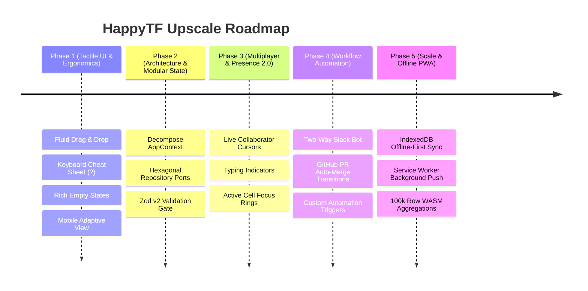

# HappyTF — Upscale Roadmap & Evolution Phases

**Target Platform:** High-Performance Collaborative Workspace & Real-Time Ticketing Platform  
**Architecture:** Next.js 15 App Router · React 19 · TypeScript · Supabase Realtime · Upstash Redis · OCC v2  

---

## Executive Overview

HappyTF has completed its core **V1 foundation** (Optimistic Concurrency Control v2, Supabase Realtime CDC, Table & Kanban views, GitHub webhook HMAC ingest, cross-client board discovery, and dynamic relative time invariance).

The **Upscale Roadmap** defines the subsequent 5 evolutionary phases to scale HappyTF into a tier-1 product comparable to Linear and Monday.com in speed, craftsmanship, and enterprise utility.

---

## Phase 1: Tactile UI/UX & Micro-Interactions (Immediate Polish)

**Goal:** Deliver instantaneous, tactile feedback that elevates HappyTF from functional to delightful.

### Key Deliverables:
1. **Fluid Kanban Drag-and-Drop**:
   - Implement drag handles and column drop zones with subtle tilt, drop shadow transitions, and spring animations.
   - Optimistically update ticket group assignments with immediate OCC token increment (`v1 -> v2`).
2. **Keyboard Shortcuts Cheat Sheet Modal (`?`)**:
   - Triggerable anywhere via `?` or `Cmd+/` / `Ctrl+/`.
   - Visual keycaps displaying all shortcuts (`Cmd+K`, `J`/`K` row stepping, `C` create, `Space` quick look, `Esc` dismiss).
3. **Rich Vector Empty States**:
   - Replace empty table/filter states with curated, dark-mode vector illustrations and contextual 1-click action triggers (`+ Add Task`, `Load Incident Template`, `Clear Filters`).
4. **Mobile & Tablet Adaptive Layout**:
   - Automatically collapse multi-column tables into dense, touch-optimized card lists on viewports `< 768px`.
   - Swipe gestures to claim or mark tasks as Done.

---

## Phase 2: State Modularization & Hexagonal Architecture

**Goal:** Break monolithic state dependencies to maximize React 19 rendering efficiency and decouple domain rules from infrastructure.

### Key Deliverables:
1. **Decompose `AppContext.tsx` (~2,700 lines) into Domain Contexts**:
   - `WorkspaceContext`: Multi-tenant switching, team roster, role permissions (`admin`/`member`/`viewer`), and folders.
   - `BoardContext`: Active board, group columns, view mode (`table`/`kanban`/`timeline`), cross-client join resolution.
   - `TicketContext`: Ticket CRUD, optimistic OCC reducers, SLA countdowns, subtask checklists.
   - `TeamChatContext`: Channel streams, thread comments, live emoji reactions.
2. **Hexagonal Architecture (Repository Pattern)**:
   - Establish `src/core/ports/` (`ITicketRepository`, `IBoardRepository`).
   - Abstract Supabase Postgres, Redis cache, and local `.data/` fallbacks behind uniform interfaces.
   - Enable 100% headless unit testing without network or database dependencies.

---

## Phase 3: Live Multiplayer Collaboration & Presence 2.0

**Goal:** Transform boards and tickets into living, shared collaborative canvases.

### Key Deliverables:
1. **Collaborator Presence & Live Focus Rings**:
   - Display colored rings around tickets currently being inspected or edited by active teammates.
   - Live avatar badges on board headers showing currently active viewers.
2. **Real-Time Typing Indicators**:
   - Show *"Marc Andrei is typing..."* in ticket comments and team channel chat feeds via lightweight WebSocket presence broadcasts.
3. **Audio & Haptic Feedback (Toggleable)**:
   - Subtle, satisfying mechanical click sounds on task completion, status toggles, and ticket claiming (with user preference toggle in Topbar).

---

## Phase 4: Workflow Automation & Bidirectional Discord Bridge

**Goal:** Unify team tools into an automated, zero-friction operational pipeline.

### Key Deliverables:
1. **CapStoneFlow Discord Bot Integration (24 Commands)**:
   - Slash command interaction gateway (`POST /api/integrations/discord/interactions`) with Ed25519 signature verification.
   - 24 slash commands across Developer, QA, and PM workflows (`/claim`, `/unclaim`, `/resolved`, `/reviewed`, `/closed`, `/leaderboard`, `/rebuild-db`, etc.).
   - Automatic bidirectional thread creation and comment synchronization with HappyTF tickets.
2. **GitHub Pull Request Auto-Transitions**:
   - Automatically advance `#TK-xxxx` to `In Review` when a PR is opened with the ticket tag.
   - Automatically mark `#TK-xxxx` as `Done` and stamp the resolution time when the pull request merges into `main`.
   - Dispatch CapStoneFlow Discord celebration embeds to `#tickets` and `#reminders` channels.
3. **Configurable Automation Engine (If-This-Then-That)**:
   - User-defined workflow rules (`src/lib/automation/engine.ts`):
     - *Trigger:* Priority set to `urgent`.
     - *Action:* Set SLA to 2 hours, notify `#reminders` on Discord, and assign on-call engineer.
     - *Trigger:* Status set to `Stuck`.
     - *Action:* Dispatch blocker alert ping to Discord channel.

---

## Phase 5: Scale, Offline Resilience & Enterprise PWA

**Goal:** Provide enterprise-grade reliability, sub-second queries on massive datasets, and full offline survivability.

### Key Deliverables:
1. **IndexedDB Local-First Persistence**:
   - Cache full board states locally in browser IndexedDB.
   - Allow seamless offline task viewing, editing, and creation with automatic background sync when reconnected.
2. **Progressive Web App (PWA) with Push Notifications**:
   - Installable desktop and mobile PWA with native OS notifications for urgent SLA breaches and assignments.
3. **WASM-Accelerated mondayDB Engine**:
   - Compile columnar filters and formula evaluations to WebAssembly for sub-10ms aggregations over 100,000+ tickets.
4. **Role-Based Access Control (RBAC) Hardening**:
   - Fine-grained permission matrices (e.g. restrict ticket deletion or group renaming to Workspace Owners and Admins).
