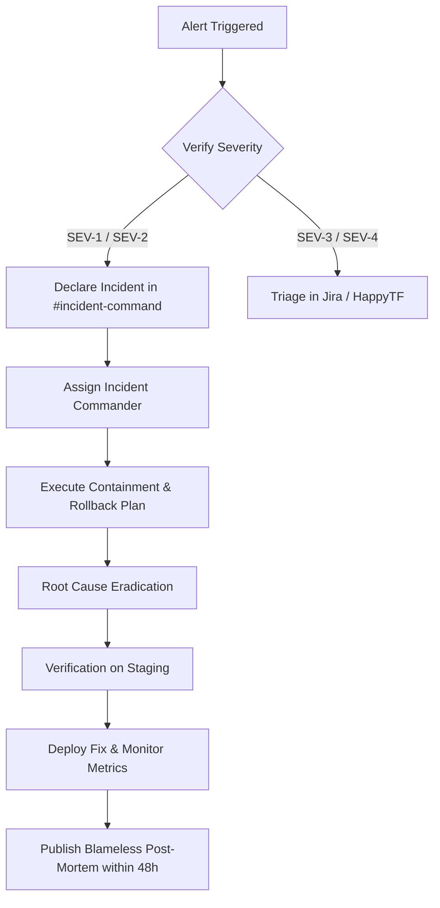

# Production Incident Triage & Response Runbook

> **Audience**: On-call Engineers, Engineering Leads, Platform Architects.

---

## 1. Incident Severity Matrix

| Severity | Definition | Target Response | Target Resolution | Escalation |
|----------|------------|-----------------|-------------------|------------|
| **SEV-1 (Critical)** | Core outage, data corruption, active security breach | < 10 mins | < 1 hour | VP Eng + On-call + Security |
| **SEV-2 (High)** | Degradation of major feature (board updates failing, realtime sync down) | < 30 mins | < 4 hours | Lead Engineer |
| **SEV-3 (Medium)** | Non-blocking bug, isolated tenant issue | < 4 hours | < 24 hours | On-call Engineer |
| **SEV-4 (Low)** | Minor UI inconsistency or cosmetic flaw | Next sprint | Next release | Product backlog |

---

## 2. Standard Triage Flow (Detection → Resolution)



---

## 3. Immediate Diagnostic Checks

```bash
# 1. Check container / serverless edge error logs
npx vercel logs happytf.dev --follow

# 2. Check Redis cache connectivity & rate limits
redis-cli -u "$REDIS_URL" ping

# 3. Check PostgreSQL connection pool saturation
# Run query in Supabase SQL editor:
SELECT count(*), state FROM pg_stat_activity GROUP BY state;
```
